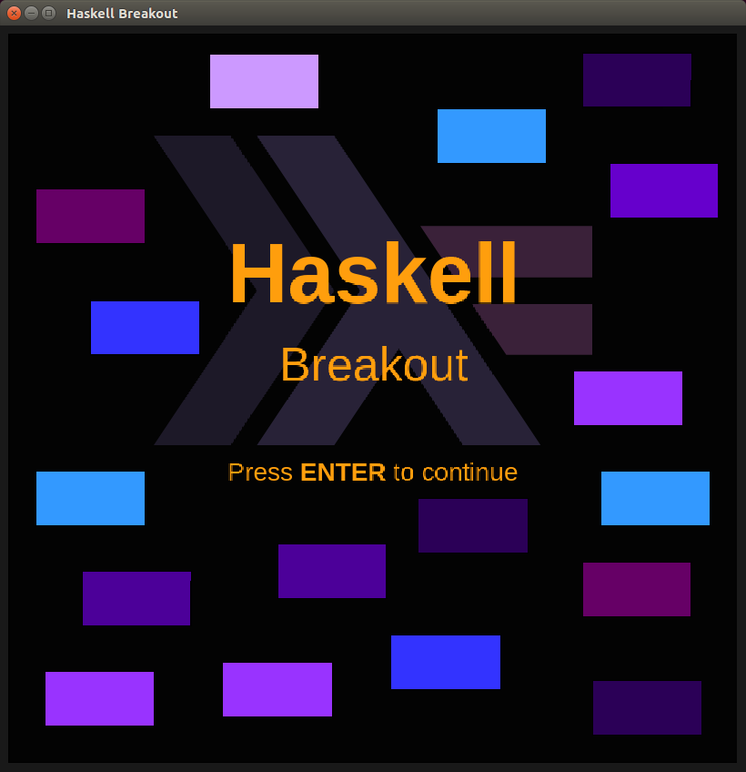
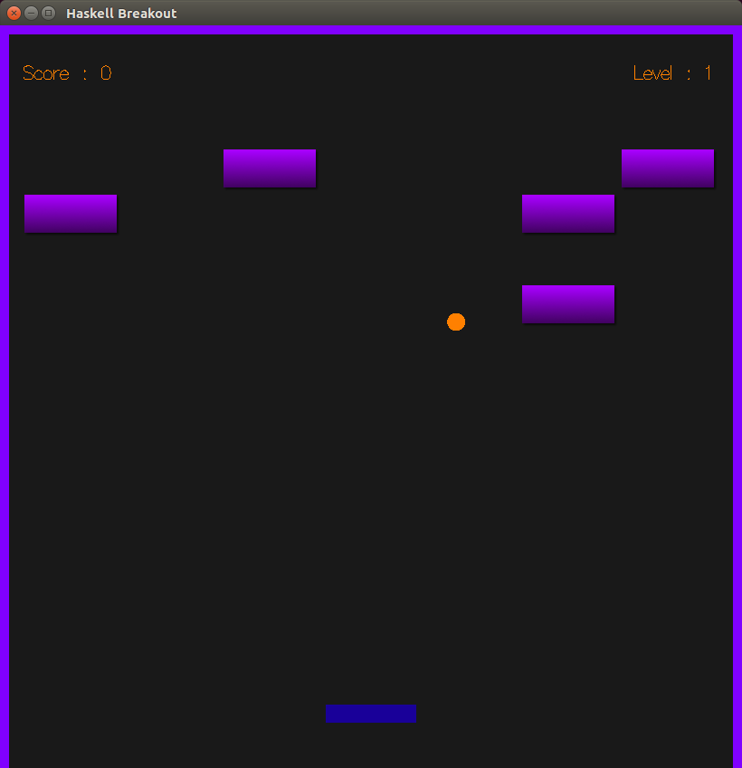
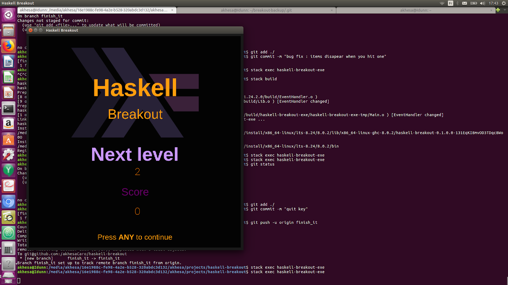
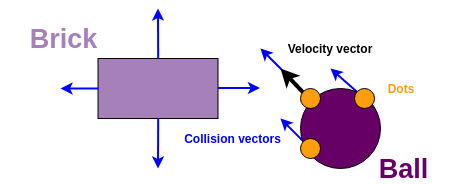
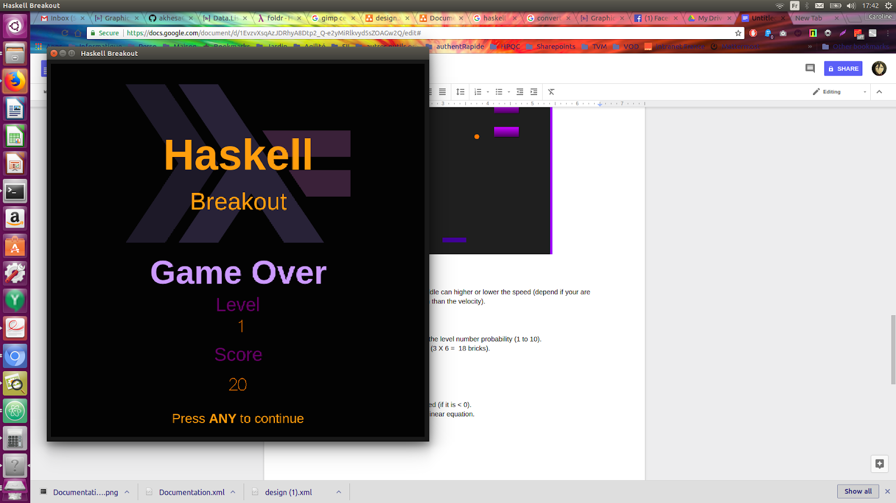

# Haskell Breakout

## Project Description

This is my second project using the Haskell programming language. My first one
was [Pong](https://github.com/akhesaCaro/haskell-pong). This time, I wanted to
try using a domain-driven approach.

## Features

My game has the following features:

- Physics for the ball (collision detection with bricks/wall/paddle, bounce).
- Mouse controls.
- Game scores.
- Game states (main menu, paused, game over, screen between levels, you win !)
- Changing ball velocity on collision with paddle.
- Hidden items in bricks.
- 10 (randomly-generated) levels.
- Cheat codes.

## Coding Philosophy

I tried to follow a domain-driven philosophy. For that reason, I chose not to
put all the types in a single module, as is often seen in Haskell projects.

I also tried to clearly separate IO operations from pure functions, keeping the
impure "part" of the code as small as possible, and implementing most of the
logic outside of `IO`.

## Dependencies

This project relies on the [Gloss](http://gloss.ouroborus.net/) library

## Highlights

### Ball speed

The ball has an initial speed but the paddle can higher or lower the speed
(depending on whether the paddle moves in the same direction as the ball
velocity or not).

### Level Generation

In each level, the bricks are drawn with the level number probability (1 to 10).
In last level (10), all bricks are rendered (3 X 6 = 18 bricks).

### Collision Detection

I ruled out my own collision detection algorithm. To detect whether a point may
hit an edge (such as a side of the paddle) in the next frame, we first check the
dot product of the direction vector and the normal of the side, and only proceed
if it is < 0. We then use Cramer's rule to find the collision point, if any.

#### Collision Vectors

To detect collision of the ball with another object, we apply the above
techniques for all three points in the diagram below.

### Cheat Codes

- Press ‘w’ key when playing show the winning state of the game.
- Press ‘n’ key when playing show the “next level” state of the game and
increment level number

## Backlog
Some ideas to make this project even better:

- High scores.
- Sounds.
- Super bricks (that need to be hit multiple times).
- Multiple lives.
- Additional items: multi-balls, extra-life, etc.
